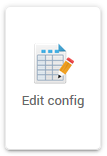
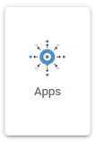
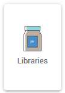
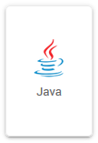
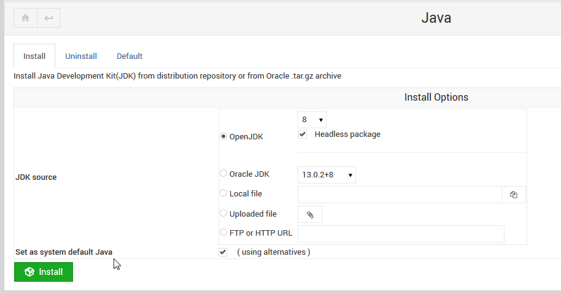
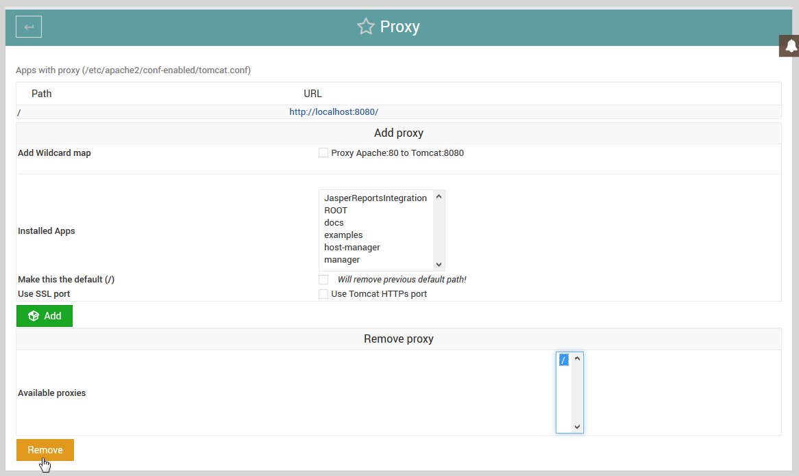

.. This is a comment. Note how any initial comments are moved by
   transforms to after the document title, subtitle, and docinfo.

.. demo.rst from: http://docutils.sourceforge.net/docs/user/rst/demo.txt

.. |EXAMPLE| image:: static/yi_jing_01_chien.jpg
   :width: 1em

**********************
General
**********************

.. contents:: Table of Contents
Edit Config
=============

The Config tab is used to edit the following files::

   application.properties
   server.xml
   web.xml
   context.xml
   tomcat-users.xml
   setenv.sh
   
These files can also be edit via the file system.

Apps
====

The Apps manager allows you to deploy, undeploy, and redeploy WAR files in Tomcat

   
Libraries
=========

The Libraries tab is for managing Jar files under /home/tomcat/<tomcat-version>/libs

This can also be done via file system, of course.

The advantage of the Libraries tab is that is tracks Jar files installed, allowing you to easily roll back changes.

Java
=========

The Java tab is during installation for installing the JDK and configuration.

It can also be used to un-install the selected JDK and replace it with a new version.

Note that when installing or removing, there is an option to set as System default.

Proxy
=========

By default, JRI Publisher enables a Proxy for Apache and maps it to 8080 to 80.

This enables you to reach reports via http://yourdomain.com/JasperReportsIntegration without need to add the 8080 port.

While this is convenient for development or intranet use, in production you should remove the proxy.

To remove the Proxy, or edit or update Proxies, click on the Proxy tab as shown below.

Select the default Proxy of / as shown below and click Remove.

