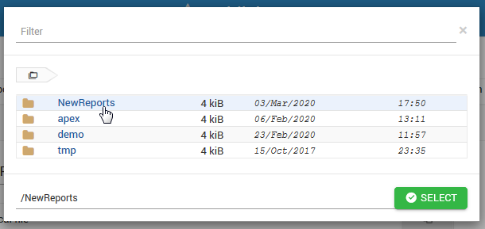

.. This is a comment. Note how any initial comments are moved by
   transforms to after the document title, subtitle, and docinfo.

.. demo.rst from: http://docutils.sourceforge.net/docs/user/rst/demo.txt

.. |EXAMPLE| image:: static/yi_jing_01_chien.jpg
   :width: 1em

**********************
Publish
**********************

.. contents:: Table of Contents
Publishing Reports
==================

To publish a report, click the Publish tab as shown below:

.. image:: _static/publish.png

This will open the screen below.  

.. note::
    The file browser location is set to /home/tomcat/apache-tomcat-v/jasper_reports/reports
    
Select the directory you wish to publish to and then select Upload to upload both your .jrxml and .jasper files.

You would also include any support files, such as image files.

Creating Directories
====================

To publish a report, click the Publish tab as shown below:

.. image:: _static/publish.png

Enter the name of the directory you wish to create as show below.

Once text is entered, upload any files you wish to.

.. image:: _static/publish-upload.png

   

