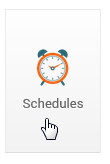
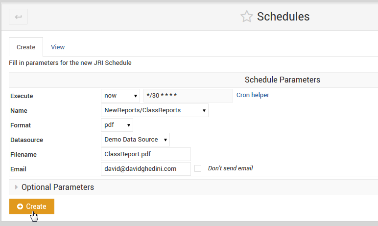

.. This is a comment. Note how any initial comments are moved by
   transforms to after the document title, subtitle, and docinfo.

.. demo.rst from: http://docutils.sourceforge.net/docs/user/rst/demo.txt

.. |EXAMPLE| image:: static/yi_jing_01_chien.jpg
   :width: 1em

**********************
Schedule
**********************

.. contents:: Table of Contents
Scheduling Reports
==================

Reports can be scheduled with a variety of options via the Schedule tab as shown below:

This will open the screen below.  

Scheduling Options
==================

The Schedule module offers the following options.

Execute::

   Options:
      now
      custom
      hourly
      weekly
      monthly
      
 now:  This will run the report immediately, with no subsequent runs.
 
 custom: This option allows you to enter a custom cron for running the report
 
 hourly, weekly, and monthly are as stated.
 
Name::

   Options:
      Drop-down list of all available reports

The Name field will display a list of all available reports.  Above, we have select the NewReports/ClassReports we created earlier.

Format::

   Options:
      csv
      docx
      html
      html2
      jxl
      pdf
      pptx
      rtf
      xls
      xlsx

Select the desired output format for the report.

Data Source::

   Options:
      Displays a drop-down list of Data Sources you have created.

Select the desired Data Source for the report.

File Name::

   Options:
      Enter the desired file name WITH Extension.
      Example: ClassReports.pdf

Select the desired Data Source for the report.

Email::

   Options:
      Enter email address or comma separated list of addresses for delivery.

Select the desired Data Source for the report.

Optional Params
===============

To publish a report, click the Publish tab as shown below. 

.. image:: _static/publish.png

Enter the name of the directory you wish to create as show below.  This will create a new directory, NewReports, under the main reports directory.

Once text is entered, upload any files you wish to.

.. image:: _static/publish-upload.png

Options
=======

There are four options for uploading files. 

1. Local File - this is a file already on the device.

2. Uploaded File - upload from your local machine.

3. HTTP or FTP URL - obtain files via HTTP or FTP

Additionally, select the options to upload zip archives as well as to over-write any existing files (for when you publish updates to your reports).

.. image:: _static/publish-options.png

   

