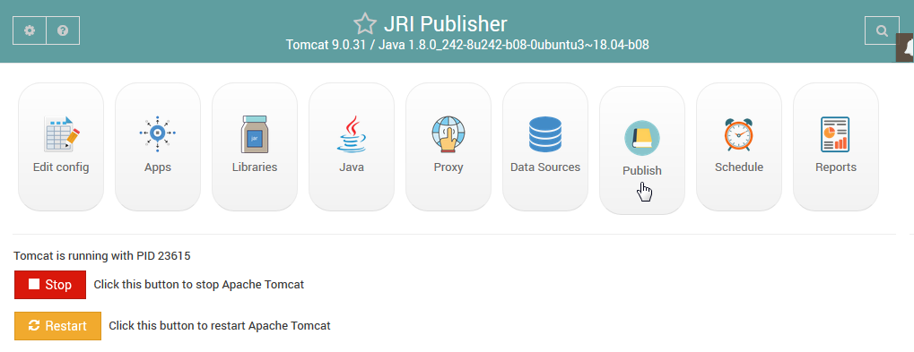

Intro
===========================

Overview
------------

JRI Publisher is a Webmin module that installs, configures, and manages Tomcat, Java, and `JasperReportsIntegration`_

.. _`JasperReportsIntegration`: https://www.opal-consulting.de/downloads/free_tools/JasperReportsIntegration/ 

It also provides Publishing, Scheduling, and Report Management.

System Requirements
-------------------
CentOS 8

Ubuntu 18

Webmin

Postfix

Editions
--------
JRI Publisher is available in two editions.

* JRI Publisher

* JRI Publisher Basic

Both editions are Free, Open Source software.

The JRI Publisher Basic edition does not contain the Schedule and Report tabs.  It is designed for those who simply want to get up and running quickly and easily with JasperReportsIntegration, as well as manage JasperReportsIntegration via Webmin.

Authors
-------
* `David Ghedini`_
* `Kaloyan Petrov`_

.. _`David Ghedini`: https://github.com/DavidGhedini
.. _`Kaloyan Petrov`: https://github.com/kaloyan13

Components
----------

http://www.opal-consulting.de/downloads/free_tools/JasperReportsIntegration/

https://community.jaspersoft.com/project/jasperreports-library

http://tomcat.apache.org/

https://openjdk.java.net/

Commercial Support
-----------------

Commercial Support is available via `Enciva LLC`_

.. _`Enciva LLC`: https://www.enciva.com

In addition to JRI Publisher, Enciva also offers a multi-user edition written in PHP.

    

