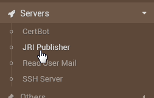
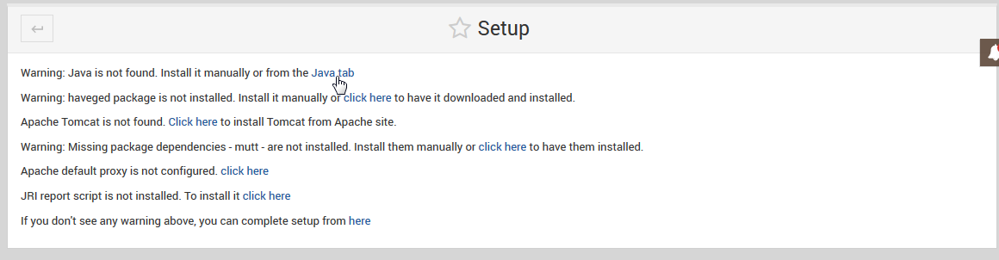
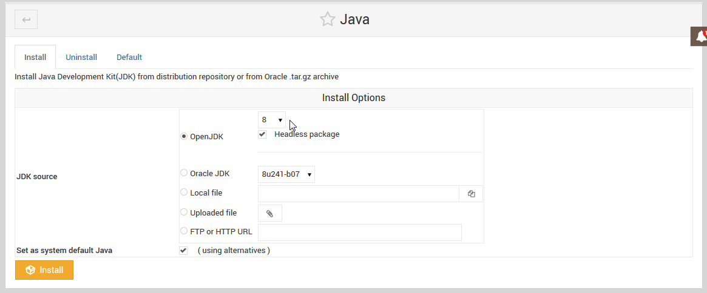
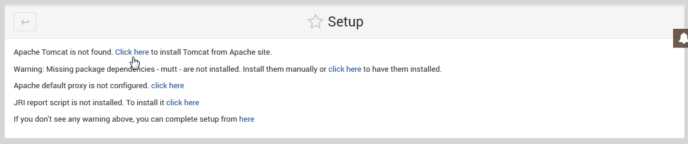
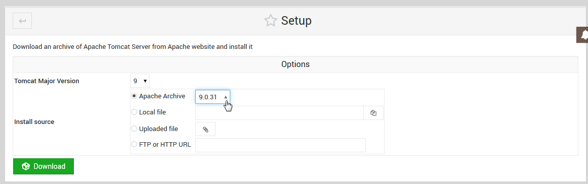
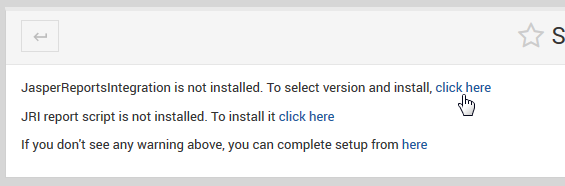
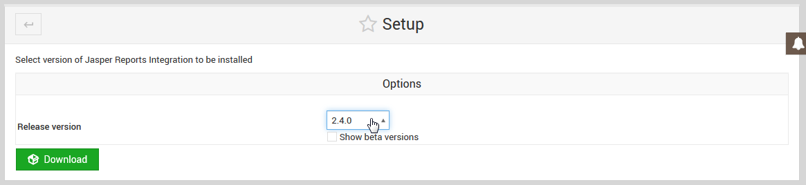
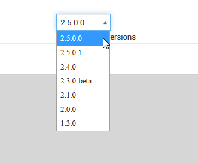
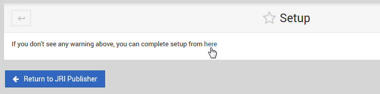
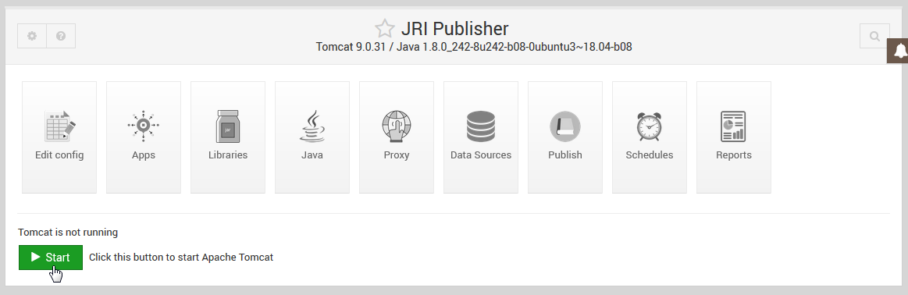

************
Wizard
************

Once the module is installed, the Wizrd is used to configure the components.

Go to Servers > JRI Publisher:

The main Wizard screen will then display each step.

While most steps are self-explanatory, we will cover Tomcat, JDK, and JRI selection below:

Select the JDK you wish to use.  We have tested with JDK 8

With JDK selected, select Tomcat version below.  

We have test with Tomcat 9.x:

With Tomcat installed, select JRI version below.  

We have tested with 2.4.0:

If you wish to use a Beta version of JRI, tick the "Show Beta Versions" box:  

Once each step of the Wizard is completed, the Wizard can be removed:

With the Wizard completed, your module should appear as below:

In your ``conf.py`` file:

.. code:: python

    import sphinx_rtd_theme

    extensions = [
        ...
        'sphinx_rtd_theme',
    ]

    html_theme = "sphinx_rtd_theme"

.. note::
    Adding this theme as an extension is what enables localization of theme
    strings in your translated output. If these strings are not translated in
    your output, either we lack the localized strings for your locale, or you
    are using an old version of the theme.

Via Git or Download
===================

Symlink or subtree the ``sphinx_rtd_theme/sphinx_rtd_theme`` repository into your documentation at
``docs/_themes/sphinx_rtd_theme`` then add the following two settings to your Sphinx
``conf.py`` file:

.. code:: python

    html_theme = "sphinx_rtd_theme"
    html_theme_path = ["_themes", ]

